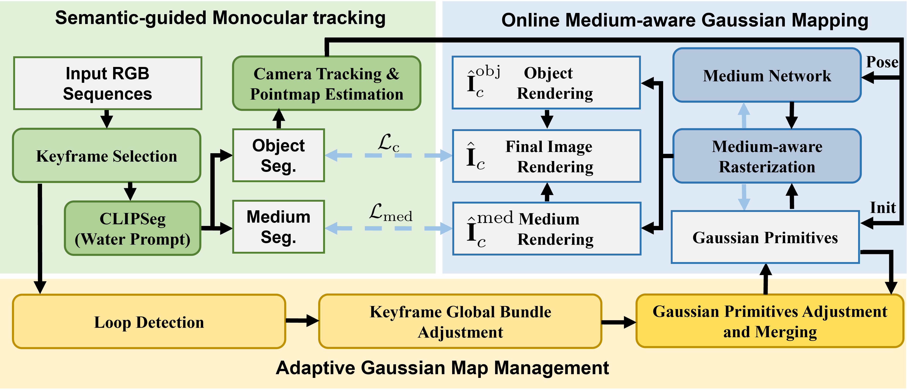

<h2 align="center">
WaterSplat-SLAM: Photorealistic Monocular SLAM in Underwater Environment
</h2>

<p align="center">
Kangxu Wang<sup>*</sup> · 
Shaofeng Zou<sup>*</sup> · 
Chenxing Jiang<sup>*</sup> · 
Yixiang Dai<sup></sup> · 
Siang Chen<sup></sup> · 
Shaojie Shen<sup></sup> · 
Guijin Wang<sup>†</sup>
</p>

<!-- <h3 align="center">
    <a href="https://arxiv.org/pdf/####">📄 Paper</a> | <a href="#">🌐 Project Page</a>
</h3> -->
<div align="center">
    
</div>

<p align="justify"> Underwater monocular SLAM is a highly challenging problem with applications ranging from autonomous underwater vehicles to marine archaeology. However, existing underwater SLAM methods struggle to generate high-fidelity rendered maps. We propose WaterSplat-SLAM, the first novel monocular underwater SLAM system to achieve robust pose estimation and photorealistic dense map construction to our knowledge.
Specifically, we combine semantic medium filtering with a dual-view 3D reconstruction prior to achieve underwater adaptive camera tracking and depth estimation. Furthermore, we propose a semantically guided rendering and adaptive map management strategy, combined with an online medium-aware Gaussian map, to model the underwater environment in a photorealistic and compact manner. Experiments on multiple underwater datasets demonstrate that WaterSplat-SLAM achieves robust camera tracking and high-fidelity rendering in underwater environments.
<br>

# Code is coming soon

## Installation
### Prerequisites

- Python 3.8+
- CUDA 11.8+

### 1. Create Environment
```bash
git clone git@github.com:KX-Wang77/WaterSplat-SLAM.git --recursive
```

if you've clone the repo without --recursive run
```bash
git submodule update --init --recursive
```
Create and activate a Conda environment:
```bash
conda env create -f environment.yml
conda activate WaterSplat-SLAM
nvcc --version
```

### 2. Install PyTorch
The default is CUDA 11.8. If you use other versions, you need to modify the cuda part in `environment.yaml`.

```bash
# CUDA 11.8
conda install pytorch==2.5.1 torchvision==0.20.1 torchaudio==2.5.1  pytorch-cuda=11.8 -c pytorch -c nvidia
# CUDA 12.1
conda install pytorch==2.5.1 torchvision==0.20.1 torchaudio==2.5.1 pytorch-cuda=12.1 -c pytorch -c nvidia
# CUDA 12.4
conda install pytorch==2.5.1 torchvision==0.20.1 torchaudio==2.5.1 pytorch-cuda=12.4 -c pytorch -c nvidia
```
### 3. Install Thirdparty Dependence
```bash
pip install -e thirdparty/mast3r
pip install -e thirdparty/in3d
pip install -e thirdparty/simple-knn
pip install -e thirdparty/fused-ssim
pip install --no-build-isolation -e .
```
Setup the checkpoints for MASt3R and retrieval. The license for the checkpoints and more information on the datasets used is written here.

```bash
mkdir -p checkpoints/
wget https://download.europe.naverlabs.com/ComputerVision/MASt3R/MASt3R_ViTLarge_BaseDecoder_512_catmlpdpt_metric.pth -P checkpoints/
wget https://download.europe.naverlabs.com/ComputerVision/MASt3R/MASt3R_ViTLarge_BaseDecoder_512_catmlpdpt_metric_retrieval_trainingfree.pth -P checkpoints/
wget https://download.europe.naverlabs.com/ComputerVision/MASt3R/MASt3R_ViTLarge_BaseDecoder_512_catmlpdpt_metric_retrieval_codebook.pkl -P checkpoints/
```

### 4. Install Gaussian Backen
```bash
cd water_gaussian
pip install -e . # install cudalight in local
```
### 5. Install tinycudann

```bash
pip install ninja
cd thirdparty/tiny-cuda-nn
cmake . -B build -DCMAKE_BUILD_TYPE=RelWithDebInfo
cmake --build build --config RelWithDebInfo -j
cd bindings/torch
python setup.py install
sudo apt updata
```

