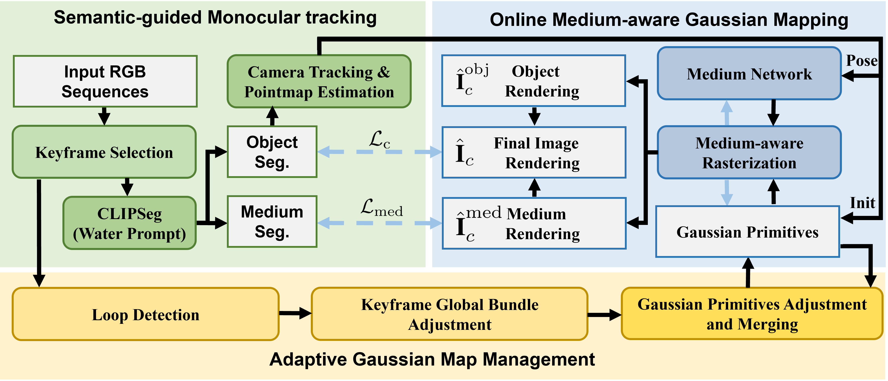
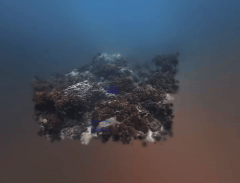
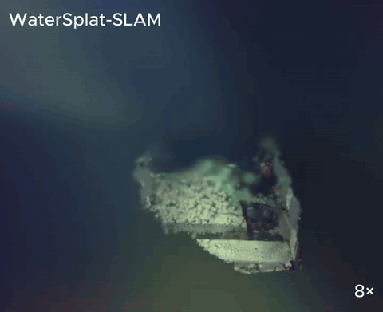

<h2 align="center">
WaterSplat-SLAM: Photorealistic Monocular SLAM in Underwater Environment
</h2>

<h3 align="center">
IEEE Robotics and Automation Letters (RA-L), 2026
</h3>

<p align="center">
<a href="https://github.com/KX-Wang77">Kangxu Wang</a><sup>*</sup> ·
<a href="https://github.com/booqo">Shaofeng Zou</a><sup>*</sup> ·
<a href="https://jiang-cx.github.io/">Chenxing Jiang</a><sup>*</sup> ·
<a href="https://github.com/Ryan-DAI01">Yixiang Dai</a> ·
<a href="https://chenthree.github.io/">Siang Chen</a> ·
<a href="https://seng.hkust.edu.hk/about/people/faculty/shaojie-shen">Shaojie Shen</a> ·
<a href="https://web.ee.tsinghua.edu.cn/wangguijin/zh_CN/index.htm">Guijin Wang</a><sup>†</sup>
</p>

<!-- <h3 align="center">
    <a href="https://arxiv.org/pdf/####">Paper</a> | <a href="#">Project Page</a>
</h3> -->

### News

- **2026-07-14**: WaterSplat-SLAM won the **Best Paper Award** at [Mapping the Reef: Underwater 3D Reconstruction for Coral Ecosystems @ RSS 2026](https://alejandrofontan.github.io/Mapping-the-Reef-RSS26/).
- **2026-02-04**: WaterSplat-SLAM was accepted by **IEEE Robotics and Automation Letters (RA-L) 2026**.

<div align="center">
    
</div>

<p align="justify"> Underwater monocular SLAM is a highly challenging problem with applications ranging from autonomous underwater vehicles to marine archaeology. However, existing underwater SLAM methods struggle to generate high-fidelity rendered maps. We propose WaterSplat-SLAM, the first novel monocular underwater SLAM system to achieve robust pose estimation and photorealistic dense map construction to our knowledge.
Specifically, we combine semantic medium filtering with a dual-view 3D reconstruction prior to achieve underwater adaptive camera tracking and depth estimation. Furthermore, we propose a semantically guided rendering and adaptive map management strategy, combined with an online medium-aware Gaussian map, to model the underwater environment in a photorealistic and compact manner. Experiments on multiple underwater datasets demonstrate that WaterSplat-SLAM achieves robust camera tracking and high-fidelity rendering in underwater environments.
</p>

## Video Demos

The following GIFs show online SLAM reconstruction and rendering results. The
Pool Loop sequence highlights the loop-closure behavior of WaterSplat-SLAM.

<table>
  <tr>
    <td align="center" width="50%"><strong>Panama Sequence</strong></td>
    <td align="center" width="50%"><strong>Pool Loop Sequence</strong></td>
  </tr>
  <tr>
    <td align="center">
      
    </td>
    <td align="center">
      
    </td>
  </tr>
</table>

## Installation

### Prerequisites

- Linux (tested on Ubuntu 20.04)
- Python 3.11
- CUDA 11.8+ (tested with CUDA 11.8)
- GPU with at least 24GB VRAM (16GB+ recommended)

### Step 1: Clone the Repository

```bash
git clone https://github.com/THU-VCLab/WaterSplat-SLAM.git --recursive
cd WaterSplat-SLAM
```

If you already cloned without `--recursive`, initialize the submodules:
```bash
git submodule update --init --recursive
```

### Step 2: Create Conda Environment

```bash
conda create --name watersplat-slam python=3.11
conda activate watersplat-slam
```

### Step 3: Install PyTorch

Install PyTorch with the appropriate CUDA version:

```bash
# CUDA 11.8
pip install torch==2.5.1 torchvision==0.20.1 torchaudio==2.5.1 --index-url https://download.pytorch.org/whl/cu118

# CUDA 12.1
pip install torch==2.5.1 torchvision==0.20.1 torchaudio==2.5.1 --index-url https://download.pytorch.org/whl/cu121

# CUDA 12.4
pip install torch==2.5.1 torchvision==0.20.1 torchaudio==2.5.1 --index-url https://download.pytorch.org/whl/cu124
```


### Step 4: Install Third-party Dependencies

```bash
pip install -r requirements.txt

# Install MASt3R (3D reconstruction backbone)
pip install --no-build-isolation -e thirdparty/mast3r

# Install in3d (visualization utilities)
cd thirdparty
pip install --no-build-isolation -e in3d
cd ..

# Install fused-ssim (CUDA-accelerated SSIM loss)
pip install --no-build-isolation thirdparty/fused-ssim

# Install simple-knn
pip install --no-build-isolation thirdparty/simple-knn/

# Install lietorch (Lie group operations)
pip install --no-build-isolation lietorch@git+https://github.com/princeton-vl/lietorch.git
```


### Step 5: Build SLAM Backend (CUDA extensions)

```bash
pip install --no-build-isolation -e .
```

This compiles the Gauss-Newton solver CUDA kernels for the SLAM backend.

### Step 6: Build Water Gaussian Renderer

```bash
cd water_gaussian
pip install --no-build-isolation -e .
cd ..
```

This compiles the `cudalight` CUDA module for underwater-adapted Gaussian rendering.

### Step 7: Install tiny-cuda-nn

Required for the medium MLP network encoding:

```bash
pip install ninja
git clone --recursive https://github.com/NVlabs/tiny-cuda-nn
cd tiny-cuda-nn
cmake . -B build -DCMAKE_BUILD_TYPE=RelWithDebInfo
cmake --build build --config RelWithDebInfo -j
cd bindings/torch
python setup.py install
cd ../../..
```

### Step 8: Download Checkpoints

Download the MASt3R pretrained weights and retrieval codebook:

```bash
mkdir -p checkpoints/
# MASt3R model weights
wget https://download.europe.naverlabs.com/ComputerVision/MASt3R/MASt3R_ViTLarge_BaseDecoder_512_catmlpdpt_metric.pth -P checkpoints/
# Retrieval model weights
wget https://download.europe.naverlabs.com/ComputerVision/MASt3R/MASt3R_ViTLarge_BaseDecoder_512_catmlpdpt_metric_retrieval_trainingfree.pth -P checkpoints/
# Retrieval codebook
wget https://download.europe.naverlabs.com/ComputerVision/MASt3R/MASt3R_ViTLarge_BaseDecoder_512_catmlpdpt_metric_retrieval_codebook.pkl -P checkpoints/
```

Download the CLIPSeg weight for water segmentation:

```bash
wget https://owncloud.gwdg.de/index.php/s/ioHbRzFx6th32hn/download -O weights.zip
unzip -d weights -j weights.zip
rm -rf weights.zip
```

## Datasets

We evaluate WaterSplat-SLAM on two groups of underwater datasets. After
downloading and extracting them, organize the repository as shown below. The
dataset directories may also be symbolic links to data stored elsewhere.

### SeaThru-NeRF

[SeaThru-NeRF](https://sea-thru-nerf.github.io/) is the CVPR 2023 dataset used
for the four real underwater scenes below. Download it from the
[official dataset link](https://drive.google.com/uc?export=download&id=1RzojBFvBWjUUhuJb95xJPSNP3nJwZWaT)
on the project page, then arrange the extracted scenes as follows:

```text
SeaThruNeRF_datasets/
├── 4_Curasao/
│   ├── images_wb/
│   └── sparse/0/
├── 5_IUI3-RedSea/
│   ├── Images_wb/
│   └── sparse/0/
├── 6_JapaneseGradens-RedSea/
│   ├── images_wb/
│   └── sparse/0/
└── 7_Panama/
    ├── images_wb/
    └── sparse/0/
```

The directory names above match the provided scene configurations. Note that
`JapaneseGradens` is retained in the local directory name for compatibility.

### WaterSplat-SLAM Dataset

Our captured dataset can be downloaded from
[Google Drive](https://drive.google.com/file/d/12fhEbn_WAv9ZsdYO3Lrt4OKQA0EP2FG6/view?usp=sharing).
Extract the archive and place the four scene directories under
`WaterSplat_datasets/`:

```text
WaterSplat_datasets/
├── big_gate/
│   ├── images/
│   └── sparse/0/
├── pipe_local/
│   ├── images/
│   └── sparse/0/
├── pool_up2/
│   ├── images/
│   └── sparse/0/
└── pool_loop/
    ├── images/
    └── sparse/0/
```

Each `sparse/0/` directory must contain the COLMAP binary model:

```text
sparse/0/
├── cameras.bin
├── images.bin
└── points3D.bin
```

For our captured scenes, both the camera intrinsics and the ground-truth camera
trajectory were estimated using COLMAP. WaterSplat-SLAM reads the intrinsics
from `cameras.bin` and the reference poses from `images.bin`.

## Running

Run a scene with its corresponding configuration:

```bash
# SeaThru-NeRF
python main.py --dataset SeaThruNeRF_datasets/4_Curasao --config config/Curasao.yaml
python main.py --dataset SeaThruNeRF_datasets/5_IUI3-RedSea --config config/RedSea.yaml
python main.py --dataset SeaThruNeRF_datasets/6_JapaneseGradens-RedSea --config config/Jap_RedSea.yaml
python main.py --dataset SeaThruNeRF_datasets/7_Panama --config config/Panama.yaml

# WaterSplat-SLAM Dataset
python main.py --dataset WaterSplat_datasets/big_gate --config config/big_gate.yaml
python main.py --dataset WaterSplat_datasets/pipe_local --config config/pipe_local.yaml
python main.py --dataset WaterSplat_datasets/pool_up2 --config config/pool_up2.yaml
python main.py --dataset WaterSplat_datasets/pool_loop --config config/pool_loop.yaml
```

To run every available scene in both dataset roots:

```bash
bash scripts/run_our_data.sh SeaThruNeRF_datasets WaterSplat_datasets
```

Missing scenes are skipped by the batch script. Results are written to the
`output.base_dir` specified by each scene configuration.
## Acknowledgements

This project builds upon several excellent works:
- [MASt3R-SLAM](https://github.com/rmurai0610/MASt3R-SLAM) - Dense stereo SLAM backbone
- [MASt3R](https://github.com/naver/mast3r) - 3D reconstruction from image pairs
- [3D Gaussian Splatting](https://github.com/graphdeco-inria/gaussian-splatting) - Neural radiance field rendering
- [Water-Splatting](https://github.com/water-splatting/water-splatting) - Underwater Gaussian splatting with medium rendering
- [Lowlight Splatting Underwater](https://github.com/booqo/lowlight-underwater-for-nerf-studio) - Underwater cudalight renderer
- [DROID-SLAM](https://github.com/princeton-vl/DROID-SLAM) - CUDA backend kernels
- [gsplat](https://github.com/nerfstudio-project/gsplat) - Gaussian splatting library

## License

This project is licensed under the [CC BY-NC-SA 4.0](https://creativecommons.org/licenses/by-nc-sa/4.0/) License. See [LICENSE.md](LICENSE.md) for details.

## Citation

If you find this work useful, please cite:

```bibtex
@ARTICLE{11417448,
  author={Wang, Kangxu and Zou, Shaofeng and Jiang, Chenxing and Dai, Yixiang and Chen, Siang and Shen, Shaojie and Wang, Guijin},
  journal={IEEE Robotics and Automation Letters}, 
  title={WaterSplat-SLAM: Photorealistic Monocular SLAM in Underwater Environment}, 
  year={2026},
  volume={11},
  number={5},
  pages={5614-5621},
  doi={10.1109/LRA.2026.3668465}
}
```
